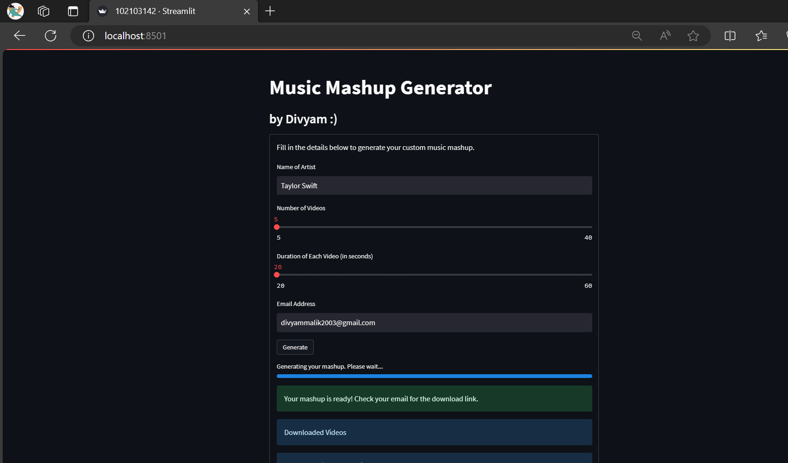

# Mashup Generator
 
Created By Divyam :)
 

  

Mashup Assignment is an innovative web application that enables users to craft captivating music mashups effortlessly. By leveraging the vast library of YouTube, Mashup Creator allows users to seamlessly blend tracks from their favorite artists into a cohesive mix.

### How It Works

1. **Search:** Users can initiate a search for their preferred artist.
2. **Customize:** Tailor the mashup by specifying parameters such as the number of tracks and duration for each.
3. **Submit:** Provide your email address to receive the finalized mashup.

Mashup Creator employs advanced techniques to ensure the highest quality mashups. It retrieves videos from YouTube, converts them to audio, trims the audio segments to the specified duration, and seamlessly merges them into a seamless mix.

### Features

- **Customization:** Adjust the mix according to your preferences.
- **High Fidelity:** Experience a seamless blend of tracks for an immersive listening experience.
- **Convenience:** Receive the finalized mashup directly in your email inbox.

### Utilized Packages

- **pytube**
- **moviepy**
- **youtube-search**

Unlock the potential of your favorite tracks and create captivating mashups with Mashup Creator today!